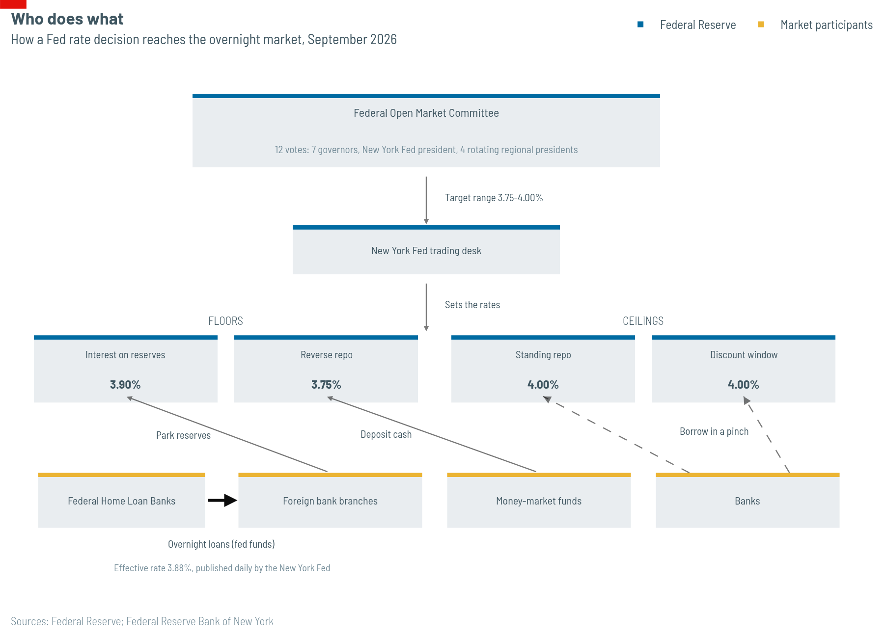
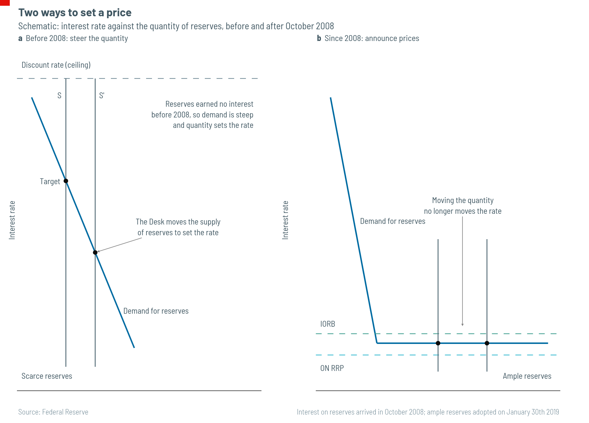
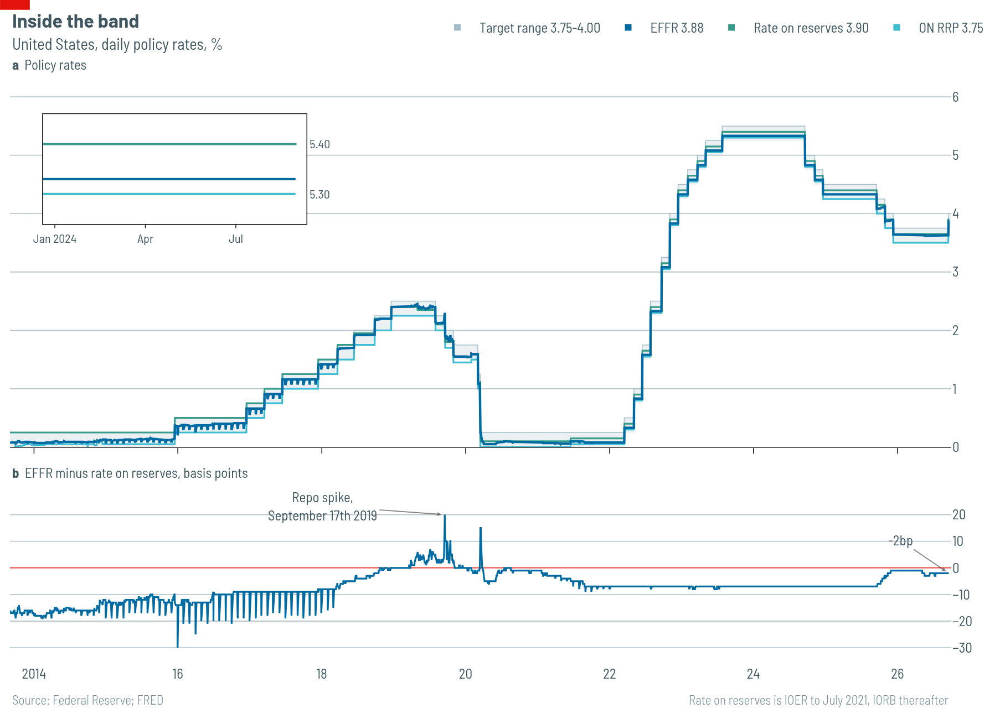

# The price of overnight money

Every working day America's Federal Home Loan Banks find cash sitting idle at the Federal Reserve. The eleven banks, cooperatives that fund mortgage lenders, keep accounts at the Fed but, unlike ordinary banks, earn no interest on them. So they lend the money out overnight, without collateral, for whatever the market will pay, since any positive rate beats nothing. The borrowers are mostly the American branches of foreign banks. They park the cash straight back at the Fed, which does pay them interest, and keep the difference.

The price the two sides agree on is the federal funds rate.

## What it is

The fed-funds rate is what banks pay to borrow reserves, the money they keep in their accounts at the central bank, for one night with nothing pledged against the loan. It is the price of overnight money in America, and most other prices in finance are set by reference to it.

Two numbers share the name. The Federal Open Market Committee, the Fed's rate-setting body, announces a target range. The market then settles somewhere inside it, and that is the effective rate. Since March 1st 2016 the New York Fed has calculated it as the volume-weighted median of the trades banks report each day. Before then it took the mean of trades arranged by brokers, a smaller and noisier sample.

The market is small and odd. The home-loan banks supply more than 90% of the lending. Daily volume ran at $150bn-175bn before 2008, fell to $60bn-80bn in the 2010s and recovered to about $110bn in 2023, a trifle beside the Treasury market. Two narrow groups of lenders and borrowers, neither doing anything a textbook would call banking, set a rate that prices credit around the world.

## Who sets it

Twelve people vote. Seven are governors of the Federal Reserve Board, nominated by the president and confirmed by the Senate. The president of the New York Fed holds a permanent eighth seat and serves as the committee's vice-chair. The other four seats rotate each year among the remaining eleven regional Fed presidents. All eleven attend every meeting and make their case, but only four vote in any year.

The committee meets eight times a year, about six weeks apart. Each meeting ends with a statement at 2pm and a short set of instructions to the New York Fed's trading desk, known simply as the Desk, on how to make the new rate stick. Four times a year the Fed also publishes its members' economic forecasts. Since January 2012 these have included the "dot plot": one unnamed dot per member, marking where each thinks the rate should be at the end of each of the next few years. The committee insists the dots are forecasts, not promises. Markets often treat them as promises anyway.

The chairman began holding press conferences in April 2011, at first four times a year. Since January 2019 one has followed every meeting.

## How it works

The Fed does not, strictly, set the fed-funds rate. It sets a price that it does not charge, in a market where it does not trade. And the way it does so has changed completely since 2008.

**Before 2008, reserves were scarce.** Money left at the Fed earned nothing, so banks held as little as they could: enough to settle payments and meet their legal requirements, and no more. Small changes in the supply of reserves therefore moved the price a lot. Take a few away and the overnight rate jumped; add a few and it fell. Each morning the Desk used that sensitivity. It lent or borrowed against Treasury bonds for short periods, in deals called repos, adjusting the stock of reserves until the rate hit a single target. A ceiling sat above: the discount rate, which the Fed charges banks that borrow from it directly. From January 2003 the Fed set it a percentage point above the target.

**Since 2008, reserves have been ample.** Congress let the Fed pay interest on reserves from October 1st 2008, and the bond-buying that followed filled banks' accounts. Reserves once counted in tens of billions of dollars now run to trillions. At that level, adding or draining a few billion no longer moves the price, and the Desk's daily trading lost its grip. Instead the Fed now steers the market with rates that it simply announces and that anyone eligible can take.

The first is the interest the Fed pays on reserves. No bank will lend for less than it can earn, without risk, by leaving the money at the Fed, so this rate sets a floor under what banks charge.

The floor leaks, because the biggest lenders in the market are not banks. The home-loan banks and money-market funds hold cash but cannot earn interest on reserves, and a lender who cannot reach the floor will lend below it. So in September 2013 the Fed started letting these firms deposit cash with it overnight, through reverse repos, at a lower rate it also sets. That rate is the true floor for the people who do the lending. It explains why the effective rate usually sits *below* the rate the Fed pays banks, not above it.

Two more facilities cap the range from above. The standing repo facility, created in 2021, lends cash against Treasuries at a fixed rate to any eligible firm. The discount window sits above that, though banks shun it: borrowing there suggests a bank had nowhere else to go. The committee formally adopted this system on January 30th 2019 and has said it will keep it.

On September 21st 2026 the target range stood at 3.75-4.00%. The Fed paid banks 3.90% on reserves and non-banks 3.75% on reverse repos. The standing repo facility and the discount window both charged 4.00%. The effective rate was 3.88%.

The system can still break. On September 17th 2019 corporate tax payments and a big settlement of Treasury sales drained cash from banks on the same morning. Repo rates jumped more than three percentage points above the top of the target range, briefly touching 10%, and the fed-funds rate followed them out of the range. The Desk had to lend as much as $100bn a day to pull it back.

## How it spreads

One night's borrowing changes nobody's investment plans. The overnight rate matters because longer rates depend on where investors expect it to go. A ten-year Treasury yield is roughly the average short rate investors expect over the next decade, plus a premium for tying money up that long. The Fed controls the first part directly and can only influence the second.

The nearest rates move almost in step. Treasury bills, commercial paper and floating-rate business loans track the fed-funds rate closely. Banks set their prime rate at the top of the target range plus three percentage points, 7.00% today, and price credit cards and home-equity loans off it. Mortgages are the exception. The 30-year mortgage rate follows the ten-year Treasury yield, not the overnight rate, so mortgages can get cheaper even while the Fed raises rates.

Further out, the effects spread and blur. Investors shift money between assets, moving corporate bond yields and share prices. Higher returns on dollar assets lift the dollar. Through all of these the rate reaches spending, then hiring and, last, prices.

It reaches them slowly. Milton Friedman called the delays "long and variable", and the description still holds. Common estimates put the biggest effect on output and inflation 12 to 18 months after a change. One review of the research finds an average of 29 months to the peak effect on prices, and Fed economists have argued for anything from 9 months to 36. A committee voting today is acting on an economy it will not see for a year or more, and it cannot judge its own decision until long after the political row over it has ended.

## How it got here

America built its central bank late and reluctantly. The panic of 1907 left it the only big financial power without one, and Congress passed the Federal Reserve Act in 1913. For its first four decades the Fed did not fully control its own policy: during and after the second world war it held down Treasury yields at the government's request. The Treasury-Fed Accord of 1951 ended that deal and gave the Fed the independence it has today.

Independence alone did not bring low inflation. Inflation rose from about 1% in 1964 to more than 12% in 1974 and roughly 15% by early 1980. In October 1979, at a Saturday-evening meeting, Paul Volcker, the Fed's chairman, changed tack. Rather than steer the fed-funds rate, the Fed would control the quantity of reserves and let the rate go wherever that took it. It went to about 20%. The prime rate hit 21.5% and unemployment 10.8%, but by late 1982 inflation was below 5%.

The change that matters most for anyone studying the data came later and quietly. Before February 1994 the Fed announced nothing. Traders inferred its decisions from what the Desk did the next morning, and often guessed wrong. Of 55 changes to the target between 1987 and 1994, only seven came at a scheduled meeting. In February 1994 the committee announced a change for the first time. By 1997 it was putting a number in its instructions to the Desk, and since 2000 it has issued a statement after every meeting. The record of announced decisions is therefore just over 30 years old, which is why the chart above starts in 1994.

That record spans the calm of the "Great Moderation"; the cut to zero on December 16th 2008 and the years of bond-buying that followed; the first rise in nearly a decade on December 16th 2015; the return to zero on the evening of Sunday March 15th 2020; and then 5.25 percentage points of rises between March 2022 and July 2023, the fastest since Volcker. In August 2025 the Fed dropped the framework it had adopted in 2020, under which it promised to make up for past misses on inflation and to respond only to shortfalls in employment. Kevin Warsh became chairman in May 2026. On September 16th 2026, with inflation still above target, the committee raised rates by a quarter of a point to 3.75-4.00%, its first rise since 2023.

That makes 30 years, eight meetings a year and twelve votes at each. The rest of this project asks what those decisions look like laid end to end.

## Sources

- [Federal Reserve Board: monetary policy](https://www.federalreserve.gov/monetarypolicy.htm)
- [Federal Reserve Bank of New York: reference rates](https://www.newyorkfed.org/markets/reference-rates/effr)
- [Liberty Street Economics](https://libertystreeteconomics.newyorkfed.org/)
- [Implementing Monetary Policy in an Ample-Reserves Regime](https://www.federalreserve.gov/econres/notes/feds-notes/implementing-monetary-policy-in-an-ample-reserves-regime-the-basics-note-1-of-3-20200701.html)
- [Federal Reserve History](https://www.federalreservehistory.org/)
