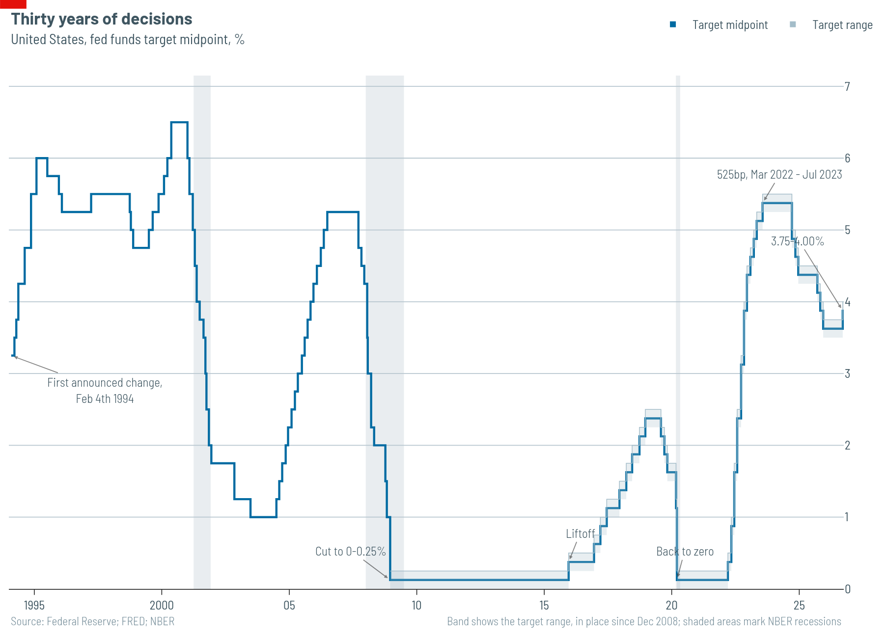

# What moves the Fed

Two models, one answer. The Federal Reserve's decisions are explained almost
entirely by what the Fed just did. Measured economic conditions — inflation,
slack, financial stress, the prescriptions of the policy rules the Fed itself
tabulates — add close to nothing once you know the recent path of the rate.

We did not set out to show this. We built one model of the level of the rate
and a second, unrelated, of the direction of each decision. They disagree about
almost everything except the conclusion.



## The record

271 decisions, February 4th 1994 to September 16th 2026. Two thirds are holds.

| Decision | Count | Share |
|---|---|---|
| Cut, 50bp or more | 19 | 7% |
| Cut, 25bp | 21 | 8% |
| Hold | 179 | 66% |
| Hike, 25bp | 41 | 15% |
| Hike, 50bp or more | 11 | 4% |

That 66% is the central difficulty. A model that always says "hold" is right
two times in three, so accuracy measures nothing. Everything below is scored
on quadratic-weighted kappa and the ranked probability score, which reward
getting the *distribution* right and punish mistakes in proportion to how far
apart the classes are.

Every feature is lagged one month behind its meeting. The committee met on
date *d* knowing the previous month's prices, not that month's: CPI for month
*m* is published in the middle of month *m+1*. A naive as-of join hands the
model data that did not exist on the day.

## Model one: the level of the rate

The standard inertial reaction function. The Fed picks a target from inflation
and slack, then moves only part of the way there:

```
i_t = rho * i_(t-1) + (1 - rho) * (r* + pi_t + a*(pi_t - 2) + b*gap_t) + e_t
```

Estimated quarterly from 1983, with Newey-West standard errors.

| | Estimate | HAC s.e. |
|---|---|---|
| rho, inertia | 0.934 | 0.023 |
| a, inflation response | 1.04 | 0.78 |
| b, slack response | 1.69 | 0.58 |

n = 175, R² = 0.972.

**The inertia is real and the slack response is real. The inflation response is
not identified.** It is right-signed and Taylor-sized, and it is also 1.3
standard errors from zero. This is not a data problem that more care would fix.
`a` and `b` are recovered as c2/(1−rho) and c3/(1−rho); as rho approaches one
that divisor collapses and takes the precision with it. The reduced-form
coefficients, which need no division, are all tightly estimated: c1 = 0.934
(0.023), c2 = 0.135 (0.056), c3 = 0.112 (0.030).

Shortening the sample makes it worse, not better:

| Sample | Monthly | Quarterly |
|---|---|---|
| 1961+ | rho .969, a 0.37 (.61) | rho .910, a 0.38 (.47) |
| 1983+ | rho .979, a 1.37 (.84) | rho .934, a 1.04 (.78) |
| 1994+ | rho .987, a **4.01** (3.67) | rho .943, a 1.50 (1.95) |

The monthly 1994 cell implies a long-run inflation response of 5.0. That is not
a finding, it is a divide-by-almost-zero. Monthly data is the aggravating
factor: the Fed meets eight times a year and holds at most of them, so monthly
observation forces rho toward one mechanically. We report quarterly for the
same reason Taylor, Clarida-Galí-Gertler and Rudebusch do.

**One genuine regime break.** Rolling 120-month windows put the median
inflation response at −0.61 before 1983 and +1.05 after, with rho steady at
0.97 throughout. That is the Clarida-Galí-Gertler result reproduced on our
data: no inflation response before Volcker, a real one after, and nothing much
changing since.

**Per-chair estimates do not survive.** Every tenure after Greenspan estimates
rho at or above one, so the division explodes — Powell's inflation response
comes out at −20.2 with a standard error of 66. Only Greenspan (n = 221) is
identified, at rho 0.949, a 0.75, b 2.38. The model now refuses to print the
rest rather than dressing them up as results.

**Against a random walk it ties.** One-step-ahead RMSE 0.548 versus 0.539, a
ratio of 1.015. It wins only after 2000 (0.982). This is close to a tautology —
a rate that does not move most months is nearly a random walk at one month —
and we report it mainly to be clear that the model is not beating a coin flip
by much.

## Model two: the direction of each decision

An ordered logit over the five classes, evaluated strictly walk-forward:
meeting *i* is predicted from meetings 0 to *i−1* only, refit each time. 171
evaluation meetings, June 2005 to January 2026. No shuffled cross-validation —
this is a time series and shuffling leaks the future.

The baseline is a leak-free expanding prior: at each meeting, the empirical
class distribution of the meetings *before* it.

| Specification | Features | Kappa | RPS |
|---|---|---|---|
| **History only** | **3** | **+0.640** | **0.0523** |
| History + rule gaps | 8 | +0.611 | 0.0580 |
| History + macro | 14 | +0.584 | 0.0726 |
| Everything | 19 | +0.548 | 0.0793 |
| Rule gaps only | 5 | +0.353 | 0.0823 |
| Macro only | 11 | +0.320 | 0.1090 |
| *Expanding prior* | — | *0* | *0.0835* |
| *Always hold* | — | *0* | *0.0921* |

The three history features are the previous decision, the number of meetings
since the last move, and whether the meeting was unscheduled. They beat the
nineteen-feature model by 34% and the honest baseline by 37%.

**Every macro feature added makes the model worse, monotonically.** Macro
levels on their own score 0.1090 against the prior's 0.0835 — worse than
knowing nothing at all. The rule gaps, which encode what the Fed's own
published rules prescribe, land at 0.0823, indistinguishable from the prior.

Note that accuracy runs backwards: the headline model is *less* accurate than
always saying hold (0.778 against a nuance-free 0.725 for the full spec), while
being far better by every proper measure. That is the trap this scoring was
chosen to avoid.

Timing matters more than features. Refitting only every eighth meeting drops
RPS to 0.125, behind the prior. The model's edge is that it tracks the current
stance, and it goes stale within a year.

## What we could not predict

**The model never once calls a 25bp cut correctly — nought for eleven.**

The obvious story is right descriptively. Small cuts are insurance: mid-cycle,
scheduled, into a strong labour market. Compared with the big cuts, the 25s
arrive with payrolls rising 86,000 a month rather than falling 81,000, the VIX
at 21 rather than 28, 5% of them unscheduled rather than 37%, and 19% in
recession rather than 42%. These are large gaps, up to 0.85 of a standard
deviation.

**They still do not separate.** Leave-one-out nearest-centroid on the pooled
small-and-large cuts classifies at 0.625 against a 0.475 base rate, and that
number is flat across every feature subset we tried. Overlap, not separation.

The diagnosis also moves the problem. Of the eleven misses, eight are called
holds and only three are called big cuts, and the model's confidence in a small
cut never exceeds 0.286. It can tell a small cut from a large one well enough.
What it cannot do is see a precautionary cut coming at all, because on the day
those meetings look like the holds on either side of them. Insurance cuts are
not identifiable ex ante from observables. Nothing was tuned to the eleven
cases.

## What this does and does not say

It does not say the Fed ignores the economy. Both models are reduced-form and
inertia absorbs everything that is persistent, including the slow-moving
economic conditions that drove the rate to where it already is. A committee
that responded instantly and fully to conditions would produce a rate series
that looked much like this one.

It does say that if you want to know what the Fed will do next, its recent
behaviour tells you nearly everything the published data can, and that the
policy rules the Fed tabulates for its own meetings carry no out-of-sample
information beyond it.

---

## Notes for whoever picks this up

**Status.** Draft by the main agent, written fast and not yet through the
`economist-writing` skill. It has not had a house-style pass: check headline
and subhead conventions, the serial comma rule, spelled-out numbers, and the
prohibition on the passive. Numbers are all verified against the code and can
be trusted; the prose cannot.

**Figures needed.** Only one existing chart is attached, and it is really the
explainer's. Four modelling charts do not exist yet. Send these to
`plot-agent`, one message per chart, and note it has a low image budget before
the API rejects the call:

1. *The ablation.* RPS by specification with the expanding prior as a reference
   line. The single most important chart — it carries the whole argument, and
   the descending staircase from three features to nineteen is the story. Data:
   `decision.ablation(X, y)`.
2. *Rolling inflation response.* `level.rolling(frame)` output, the `a` series
   with its 1983 break marked. Needs care: pre-1983 windows where rho exceeds
   one produce values from −561 to +487, so clip the axis and say in the
   footnote that you have.
3. *The specification grid.* `level.specification_grid(frame_m, frame_q)` as a
   coefficient plot with error bars, showing `a` straddling zero in all six
   cells while `b` does not. Six rows, two panels.
4. *The cut25 confusion.* Where the eleven small cuts actually go. A 5x5 matrix
   is the honest form but reads poorly at slide size; consider a slope or
   flow chart instead, and let the plot agent choose.

**Loose ends.**
- Dissent counts start March 2002; earlier votes are in the minutes only. If
  dissents should be a model feature across the full sample, that is a
  minutes-parsing job nobody has done.
- Column-contract tests assert that columns exist and are documented, not that
  they contain anything. `target_mid` was silently all-NaN for a while and the
  suite stayed green. The IOER splice tests check values — copy that pattern to
  the other spliced columns.
- `r_star` is a constant 2.0 in the shipped frame, so the decision model drops
  it automatically. The Holston-Laubach-Williams series is wired up and
  available via `build_frame(r_star="hlw")` but nothing has been re-run on it.
- The two slow tests (~3 minutes) are marked and deselected by default. Run
  `uv run pytest -m slow` before trusting any change to the models.
