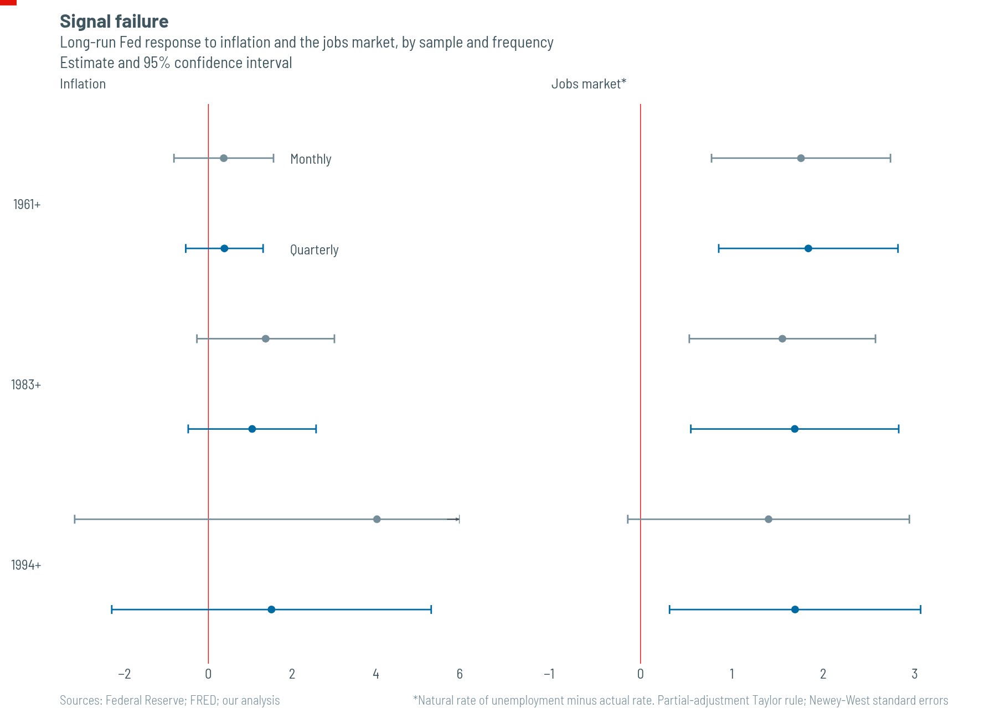
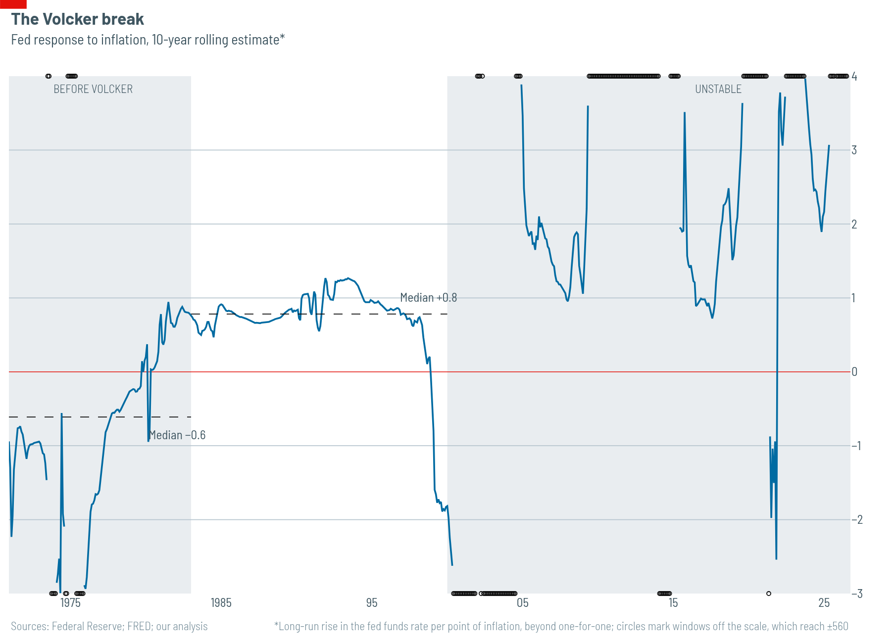
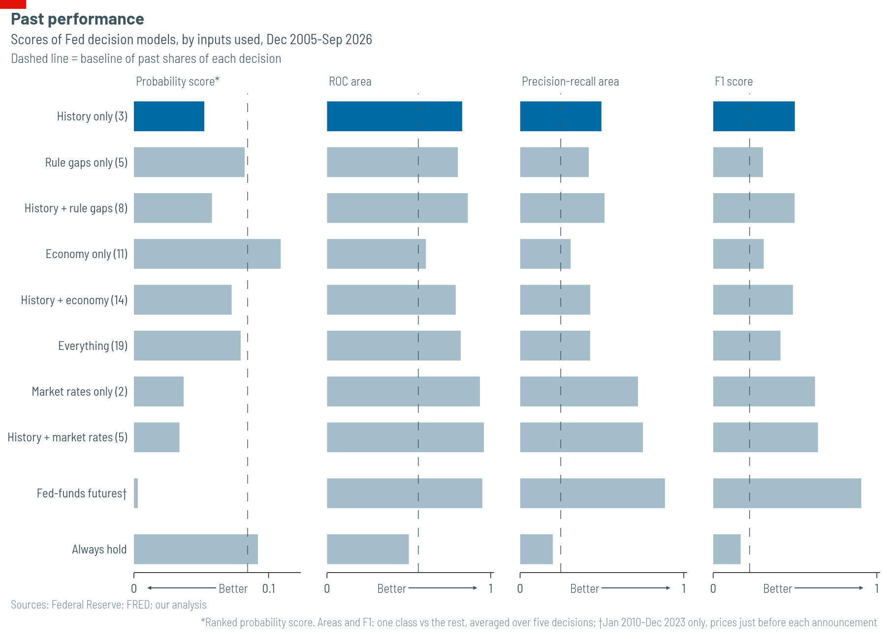
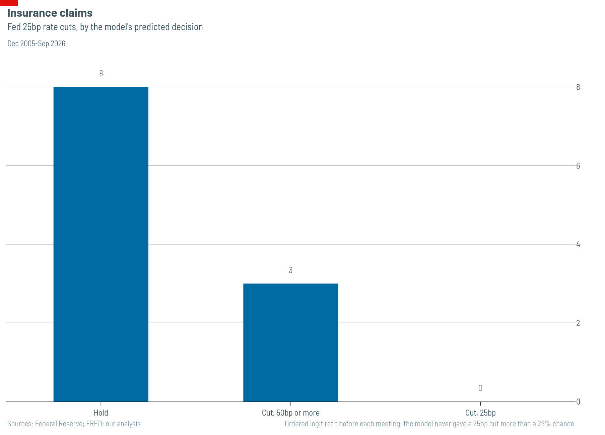

# What moves the Fed

The best guide to what the Federal Reserve will do next is what traders expect it to do. The next best is what it has just done. Once you know the recent path of interest rates, monthly figures on inflation, unemployment and financial stress add nothing to a forecast, and the policy rules the Fed calculates for its own meetings add little.

We did not set out to show this. We built two unrelated models, one of the level of the Fed's target rate and one of the direction of each decision. They disagree about nearly everything except the weakness of the economic data.

## The record

The Federal Open Market Committee, the Fed's rate-setting body, made 271 decisions between February 4th 1994 and September 16th 2026. Two-thirds were holds.

| Decision | Count | Share |
| --- | --- | --- |
| Cut, 50bp or more | 19 | 7% |
| Cut, 25bp | 21 | 8% |
| Hold | 179 | 66% |
| Rise, 25bp | 41 | 15% |
| Rise, 50bp or more | 11 | 4% |

(A basis point, bp, is a hundredth of a percentage point.)

That 66% is the central difficulty. A model that always says "hold" is right two times in three, so accuracy tells you little. We therefore use scores that give the rare decisions their due:

- **Weighted kappa** measures agreement with the actual decisions beyond what chance would give, and punishes a miss more the further it lands from the truth.
- **The ranked probability score** rewards a model for putting its probability on the right outcome and on outcomes near it. Lower is better.
- **The area under the ROC curve** asks, for each kind of decision, how often the model ranks a meeting that took it above one that did not. Always saying hold scores 0.5.
- **The area under the precision-recall curve** asks the same question but punishes false alarms on rare decisions harder. Always saying hold scores the share of each decision, 0.2 on average.
- **F1** balances how many of each decision the model catches against how many of its calls are right.

The last three are computed for each of the five kinds of decision against the rest and then averaged, so a 25bp cut counts as much as a hold.

We also lag every input by a month. The committee sets rates knowing last month's figures, not this month's: consumer prices for one month appear only in the middle of the next. Matching each meeting to data dated the same month hands the model figures that did not yet exist.

## Model one: the level of the rate

The first model is the standard one. The Fed picks a target for its rate based on inflation and slack in the economy, then moves only part of the way towards it at each step:

$$
i_t = \rho\, i_{t-1} + (1-\rho)\left[r^* + \pi_t + a\,(\pi_t - \pi^*) + b\, g_t\right] + \varepsilon_t
$$

Here $i_t$ is the policy rate, $\pi_t$ core inflation, $\pi^* = 2\%$ the Fed's target, $r^*$ the neutral real rate and $g_t$ slack. $\rho$ measures inertia. $a$ is the response to inflation beyond one-for-one, so the rate rises by $1 + a$ points in the long run for each point of inflation, and $b$ is the response to slack. Subtracting $r^* + \pi^*$ from both sides gives the form we estimate by least squares:

$$
i_t - r^* - \pi^* = c_1\,(i_{t-1} - r^* - \pi^*) + c_2\,(\pi_t - \pi^*) + c_3\, g_t + \varepsilon_t
$$

so that

$$
\rho = c_1, \qquad a = \frac{c_2}{1-\rho} - 1, \qquad b = \frac{c_3}{1-\rho}.
$$

We estimate it on quarterly data from 1983, with standard errors robust to the correlation between neighbouring quarters.

| | Estimate | Standard error |
| --- | --- | --- |
| $\rho$, inertia | 0.934 | 0.023 |
| $a$, inflation response | 1.04 | 0.78 |
| $b$, slack response | 1.69 | 0.58 |

$n = 175$, $R^2 = 0.972$.

**Inertia and the response to slack are clear. The response to inflation is not.** It has the right sign but lies just 1.3 standard errors from zero. More care with the data will not fix this. The model recovers $a$ and $b$ by dividing by $1-\rho$, and as $\rho$ nears one the divisor shrinks and takes the precision with it. The coefficients estimated before that division are all tight: $c_1 = 0.934$ (0.023), $c_2 = 0.135$ (0.056) and $c_3 = 0.112$ (0.030).

Shortening the sample makes things worse:

| Sample | Monthly | Quarterly |
| --- | --- | --- |
| 1961 on | $\rho = 0.969$, $a = 0.37$ (0.61) | $\rho = 0.910$, $a = 0.38$ (0.47) |
| 1983 on | $\rho = 0.979$, $a = 1.37$ (0.84) | $\rho = 0.934$, $a = 1.04$ (0.78) |
| 1994 on | $\rho = 0.987$, $a = \mathbf{4.01}$ (3.67) | $\rho = 0.943$, $a = 1.50$ (1.95) |

Standard errors in brackets.

The monthly estimate from 1994 implies that, in the long run, the Fed raises rates by $1 + a \approx 5$ points for every point of inflation. That is not a finding; it is division by almost zero. Monthly data make the problem worse. The Fed meets eight times a year and usually holds, so most months show no change and $\rho$ is pushed towards one. We report quarterly estimates, as Taylor, Richard Clarida, Jordi Galí, Mark Gertler and Glenn Rudebusch did.

**The model finds one real break.** Across rolling ten-year windows ending before 1983, the median $a$ is −0.61: the Fed raised rates by less than inflation rose, so real rates fell as prices climbed. For windows ending between 1983 and 1999 the median is +0.78, and the estimate holds steady: the Fed raised rates by more than inflation, so real rates rose. This reproduces the result of Clarida, Galí and Gertler on our data: the Fed did not lean against inflation before Paul Volcker, and did afterwards.

After 2000 the estimate falls apart. Median $\rho$ climbs from 0.93 in the 1983-99 windows to 0.98, and the division by $1-\rho$ throws 54% of windows ending since 2000 off the chart's scale, some as far as ±560. Since 2000 the rolling windows cannot pin down the Fed's response to inflation at all.

**Estimates for individual chairmen fail.** For every chairman since Alan Greenspan, $\rho$ comes out at or above one and the division blows up: Jerome Powell's $a$ is −20.2, with a standard error of 66. Only Greenspan's 221 months yield usable figures: $\rho = 0.949$, $a = 0.75$ and $b = 2.38$. The code declines to report the others.

**Against a random walk, the model ties.** Forecasting one month ahead, its root-mean-square error is 0.548 against 0.539 for simply assuming no change, a ratio of 1.015. It wins only after 2000, with a ratio of 0.982. That is almost built in: a rate that does not move in most months is nearly a random walk over a month. We report it to be clear that the model barely beats a naive guess.

## Model two: the direction of each decision

The second model predicts which of the five kinds of decision the committee will take, using an ordered logit, a regression suited to ranked outcomes. We test it strictly forward in time: we predict each meeting from the meetings before it alone, refitting every time. That gives 171 test meetings, from December 2005 to September 2026. Shuffling the data for cross-validation, a common shortcut, would leak the future into the past.

The baseline is the share of each kind of decision among the meetings before each one, which uses no future data either.

We feed the model four kinds of input, each with its own literature.

### Inertia

The Fed moves in small steps and seldom reverses soon after a move. Michael Dueker (1999) and Liang Hu and Peter Phillips (2004) modelled changes in the target as ordered choices that depend on the previous change. James Hamilton and Òscar Jordà (2002) added the time since the rate last moved. Our history inputs follow them: the previous decision, the number of meetings since the rate last moved, and whether the meeting was unscheduled.

### Rules and the economy

John Taylor (1993) showed that a simple rule, setting the rate from inflation and the gap between output and its potential, tracked the Fed's decisions from 1987 to 1992. Athanasios Orphanides (2001) showed that such rules fit much worse on the data the committee actually had at the time, which is why we lag every input. Since 2017 the Fed has published the prescriptions of several rules in its twice-yearly Monetary Policy Report. Our rule gaps are the distance between the actual rate and five of them. Our economic inputs are 11 monthly series on inflation, jobs, output and financial stress.

### Market rates

Traders bet on the Fed's next move, and short-term Treasury yields carry those bets. Hamilton and Jordà found that the spread of the six-month Treasury-bill rate over the target helped predict changes. Joachim Grammig and Kerstin Kehrle (2008) built on their model. Our market inputs are the three- and six-month bill rates on the last trading day before each meeting, less the previous target.

### Futures

Fed-funds futures pay out on the average overnight rate in a given month, so their prices give the rate traders expect almost directly. Kenneth Kuttner (2001) showed how to read the expected change at a single meeting from them. Refet Gürkaynak, Brian Sack and Eric Swanson (2007) found that futures beat other market measures at forecasting the rate over the next few months. CME Group's FedWatch tool turns futures prices into a probability for each outcome by splitting the expected change between the two nearest quarter-point steps; we do the same. Our prices come from Michael Bauer and Eric Swanson (2023), via the San Francisco Fed, and are taken minutes before each announcement. They run from January 2010 to December 2023.

### Results

| Model | Inputs | Kappa | Probability score | ROC area | PR area | F1 | Accuracy |
| --- | --- | --- | --- | --- | --- | --- | --- |
| History only | 3 | 0.64 | 0.052 | 0.83 | 0.50 | 0.50 | 78% |
| History + rule gaps | 8 | 0.61 | 0.058 | 0.86 | 0.52 | 0.50 | 73% |
| History + economy | 14 | 0.58 | 0.073 | 0.79 | 0.43 | 0.49 | 70% |
| Everything | 19 | 0.55 | 0.079 | 0.82 | 0.43 | 0.41 | 68% |
| Rule gaps only | 5 | 0.35 | 0.082 | 0.80 | 0.42 | 0.31 | 68% |
| Economy only | 11 | 0.32 | 0.109 | 0.60 | 0.31 | 0.31 | 64% |
| Market rates only | 2 | 0.74 | 0.037 | 0.93 | 0.72 | 0.62 | 81% |
| **History + market rates** | **5** | **0.77** | **0.034** | **0.96** | **0.75** | **0.64** | **81%** |
| *Past shares* | — | *0.04* | *0.084* | *0.56* | *0.25* | *0.22* | *72%* |
| *Always hold* | — | *0* | *0.092* | *0.50* | *0.20* | *0.17* | *73%* |

**Market rates beat everything else.** Two bill rates, with nothing else, give a probability score of 0.037, against 0.052 for history. Adding history lowers it to 0.034, 35% below history alone, and lifts the precision-recall area from 0.50 to 0.75.

**History comes next.** With its three inputs alone, the model's probability score is 34% lower than the 19-input model's and 38% lower than the baseline's. It doubles the baseline's precision-recall area and more than doubles its F1.

**Adding economic data makes the model worse on every score.** Alone, they barely beat the baseline at ranking decisions and score worse than it on probabilities, 0.109 against 0.084. Added to history, they lower every score.

**The Fed's own rules are a closer call.** Alone, the rule gaps rank decisions well, with an ROC area of 0.80, but their probability score is no better than the baseline's. Added to history, they lift the ROC area from 0.83 to 0.86 and the precision-recall area from 0.50 to 0.52, while worsening the probability score from 0.052 to 0.058 and leaving F1 unchanged. The rules help the model order meetings slightly but make its probabilities less reliable. On 171 meetings, differences this small could be noise.

Accuracy would hide much of this. Always saying hold is right 73% of the time; the history model manages 78%. The 19-input model, at 68%, is less accurate than always saying hold, yet scores far better on every other measure, because it catches some of the rarer decisions that the hold rule never does.

The model does not need constant refitting. Refit only every eighth meeting, about once a year, the history model scores 0.0542 against 0.0523, still far ahead of the baseline. Its edge comes from inputs that track the Fed's latest moves, not from re-estimating the model.

**Futures are almost never wrong, but they are not a fair rival.** Because their data cover only 2010-23, we compare them on the 113 meetings in that window.

| Model | Kappa | Probability score | ROC area | PR area | F1 | Accuracy |
| --- | --- | --- | --- | --- | --- | --- |
| History only | 0.58 | 0.047 | 0.80 | 0.53 | 0.42 | 80% |
| History + rule gaps | 0.59 | 0.053 | 0.84 | 0.50 | 0.47 | 74% |
| Market rates only | 0.80 | 0.025 | 0.95 | 0.80 | 0.49 | 87% |
| History + market rates | 0.79 | 0.026 | 0.96 | 0.80 | 0.60 | 85% |
| **Futures** | **0.99** | **0.003** | **0.95** | **0.89** | **0.91** | **99%** |
| *Past shares* | *0.01* | *0.066* | *0.67* | *0.27* | *0.17* | *77%* |
| *Always hold* | *0* | *0.073* | *0.50* | *0.20* | *0.18* | *78%* |

Futures miss one decision in 113: on March 3rd 2020, at an unscheduled meeting, they priced a quarter-point cut and the Fed cut by half a point. Their probability score is a tenth of any model's. That says more about the Fed than about futures. The committee now signals its intentions in speeches, minutes and statements, and by the minutes before an announcement traders have priced it in. Bill rates on the eve of a meeting carry the same signal but less cleanly, since they also move with the supply of bills and the demand for safe assets. Both measure how well the Fed communicates, not how well an outsider can forecast it weeks ahead.

## What we could not predict

**The history model never correctly calls a 25bp cut: it scores nought out of eleven.**

The obvious story fits the facts. Small cuts are insurance, made in the middle of a cycle, at scheduled meetings, with the jobs market still strong. Compared with big cuts, small ones come as payrolls grow by 86,000 a month rather than shrink by 81,000, with the VIX, a gauge of expected stockmarket turbulence, at 21 rather than 28. Just 5% come at unscheduled meetings, against 37% of big cuts, and 19% during recessions, against 42%. Some of these gaps reach 0.85 of a standard deviation.

**Yet the two kinds of cut still overlap.** Assigning each cut to whichever group's average it sits nearer, leaving it out of that average, sorts 62.5% of them correctly, against 47.5% by guessing the more common kind. That figure barely moves whichever inputs we use.

The errors point elsewhere. Of the eleven misses, the model calls eight holds and only three big cuts, and it never gives a small cut more than a 29% chance. Its ranking is not hopeless: for small cuts its precision-recall area is 0.24, against 0.07 for the baseline. It puts them above chance, but never on top. It can tell small cuts from big ones well enough. What it cannot do is see a precautionary cut coming, because on the day such meetings look like the holds either side of them. We tuned nothing to these eleven cases.

Markets see a little more. The bill-rate models each call two of the eleven, and never give a small cut more than a 46% chance. Both call the three insurance cuts of 2019 holds, with 81-91% confidence. Futures, whose data cover only those three of the eleven, call all three correctly. Nothing in the published economic data flags an insurance cut in advance; the Fed's own signals in the weeks before do.

## What this does and does not show

It does not show that the Fed ignores the economy. Both models are simple statistical fits, and inertia absorbs everything persistent, including the slow-moving economic conditions that took the rate to where it already is. A committee that responded quickly and fully to the economy could produce a rate series much like this one. Nor does it show that monthly data are useless to traders: market prices already reflect them, along with everything else traders know.

It does show that, to predict the Fed's next move, market prices beat the Fed's recent behaviour, and that recent behaviour tells you nearly everything monthly economic data can. Economic data add nothing beyond it, and the policy rules the Fed calculates for its own meetings add little.

## Caveats

- The neutral real rate, $r^*$, is fixed at 2%. A time-varying estimate from Thomas Laubach and John Williams, later with Kathryn Holston, is available in the code but untested in these models.
- Records of dissenting votes start in March 2002. Earlier dissents sit only in the minutes, so dissent is not an input.
- The market and futures benchmarks use prices from after the Fed's pre-meeting signals: the last trading day before each meeting for bills, minutes before the announcement for futures.

## Further reading

- Bauer, M. and Swanson, E. (2023), "A reassessment of monetary policy surprises and high-frequency identification", *NBER Macroeconomics Annual*. [Data](https://www.frbsf.org/wp-content/uploads/monetary-policy-surprises-data.xlsx)
- Dueker, M. (1999), "Measuring monetary policy inertia in target fed funds rate changes", *Federal Reserve Bank of St Louis Review*.
- Grammig, J. and Kehrle, K. (2008), "A new marked point process model for the federal funds rate target", *Journal of Economic Dynamics and Control*.
- Gürkaynak, R., Sack, B. and Swanson, E. (2007), "Market-based measures of monetary policy expectations", *Journal of Business & Economic Statistics*.
- Hamilton, J. and Jordà, Ò. (2002), "A model of the federal funds rate target", *Journal of Political Economy*.
- Hu, L. and Phillips, P. (2004), "Dynamics of the federal funds target rate: a nonstationary discrete choice approach", *Journal of Applied Econometrics*.
- Kuttner, K. (2001), "Monetary policy surprises and interest rates: evidence from the Fed funds futures market", *Journal of Monetary Economics*.
- Orphanides, A. (2001), "Monetary policy rules based on real-time data", *American Economic Review*.
- Taylor, J. (1993), "Discretion versus policy rules in practice", *Carnegie-Rochester Conference Series on Public Policy*.
